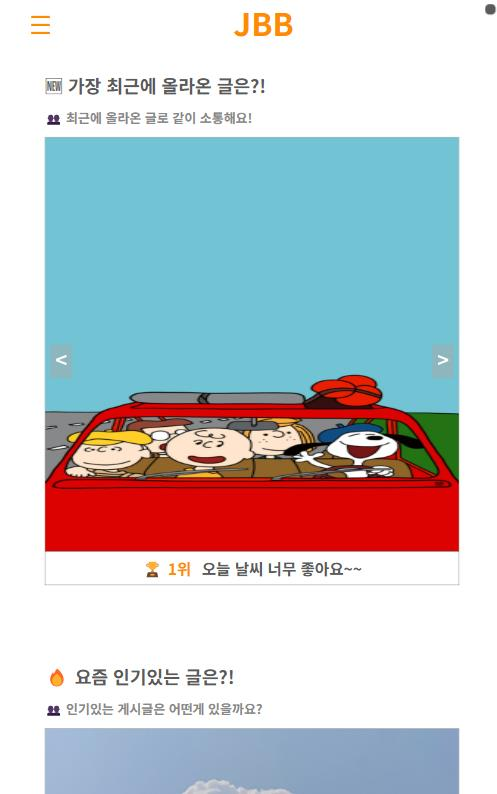
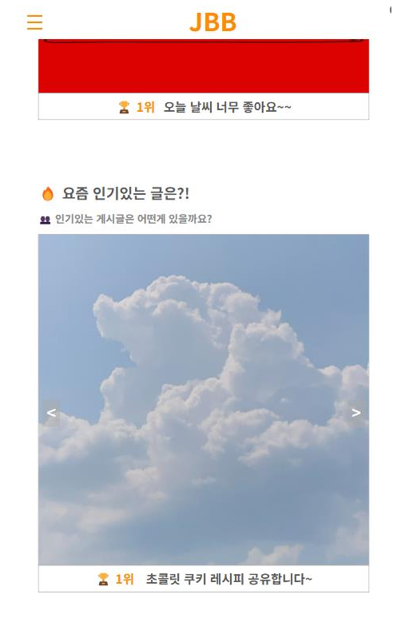
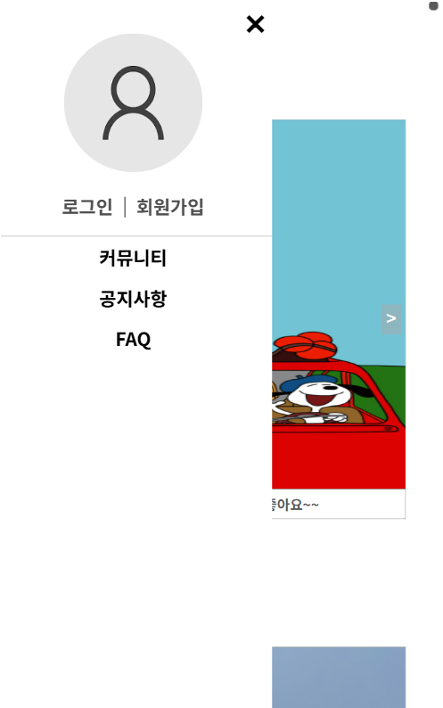
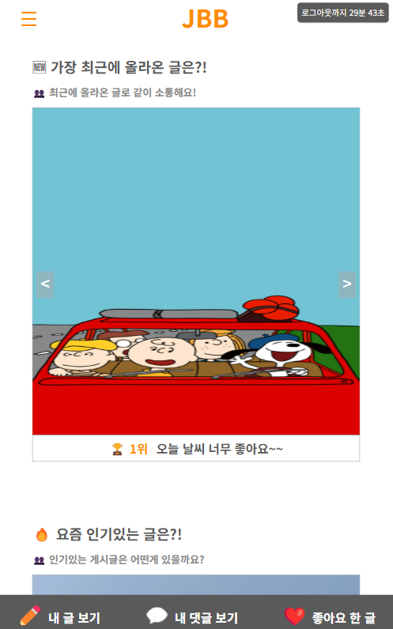
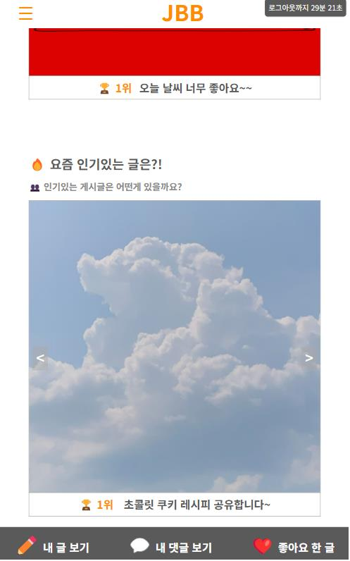
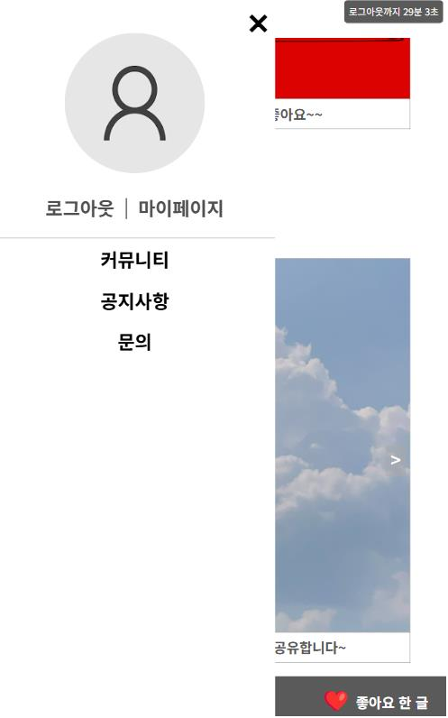

# JBB 게시판 프로젝트
“사용성과 운영 효율을 함께 고려한 게시판 프로젝트로, 사용자 중심의 기능부터 관리자 인사이트 기능까지 직접 기획 및 구현했습니다.”

## 🔧사용 기술
- Java(JDK 1.8), HTML/CSS, JavaScript
- Apache Tomcat 9.0
- STS 3, MyBatis
- MySQL
- Jquery

## 💡 주요 기능
### 사용자 페이지
- 게시판 이용(작성,수정,삭제,조회)
- 카테고리별 게시글 분류 및 필터링
- 이미지 업로드 기능
- 로그인한 사용자만 좋아요 기능
- 중복 좋아요 방지(토글 방식)
- 질문 작성 및 답변 확인
- 관리자가 답변을 달면 ‘답변 완료’ 표시
- 하단바 : 작성한 글, 댓글, 좋아요 누른 게시물 표시 / 스크롤 내려도 고정
- 메인 페이지 : 최신글 & 인기글(조회수 기반) Top5 슬라이더

### 관리자 페이지
- 사용자 관리 : 회원 목록 조회/ 관리
- 문의내역 관리 : QNA 게시판의 질문 확인 및 답변 작성
- 게시판 관리 : 게시글 관리
- 인사이트 분석 기능(데이터 분석 도입) : 사용자 통계 (신규 가입자 수, 사용자 활동 빈도) / 게시판 사용량 분석(카테고리별 게시글 수, 일별 게시글 작성 수)

## 📷 프로젝트 주요 화면
### 로그인 전 메인페이지

  
  
  

### 로그인 후 메인페이지

  
  
  

