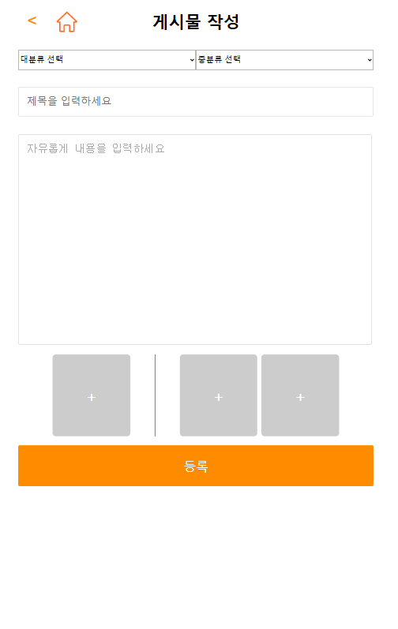
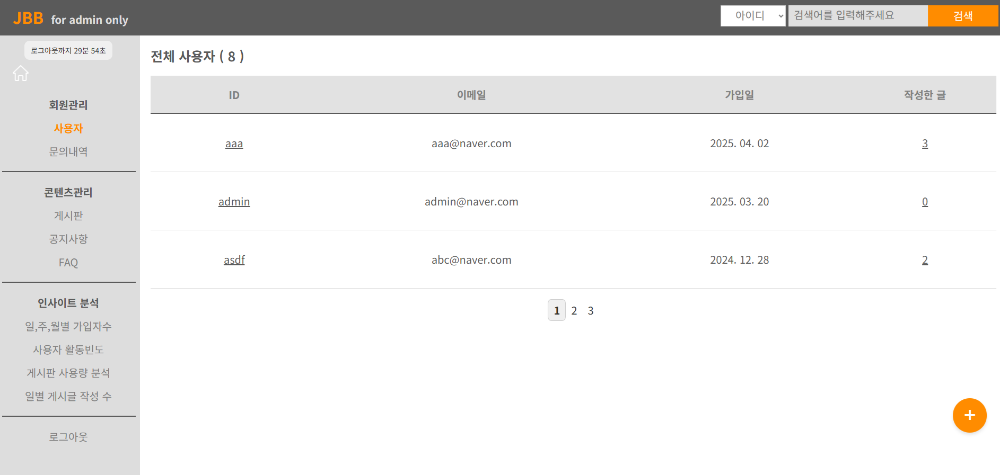

# JBB 게시판 프로젝트
“사용성과 운영 효율을 함께 고려한 게시판 프로젝트로, 사용자 중심의 기능부터 관리자 인사이트 기능까지 직접 기획 및 구현했습니다.”

## 🔧사용 기술
- Java(JDK 1.8), HTML/CSS, JavaScript
- Apache Tomcat 9.0
- STS 3, MyBatis
- MySQL
- Jquery

## 💡 주요 기능
### 사용자 페이지
- 게시판 이용(작성,수정,삭제,조회)
- 카테고리별 게시글 분류 및 필터링
- 이미지 업로드 기능
- 로그인한 사용자만 좋아요 기능
- 중복 좋아요 방지(토글 방식)
- 질문 작성 및 답변 확인
- 관리자가 답변을 달면 ‘답변 완료’ 표시
- 하단바 : 작성한 글, 댓글, 좋아요 누른 게시물 표시 / 스크롤 내려도 고정
- 메인 페이지 : 최신글 & 인기글(조회수 기반) Top5 슬라이더
- 세션 타이머 기능 : 세션 만료 시간을 설정해서 모든 페이지 상단에 남은 시간 표시/ 5분전 연장 버튼 나타남/ 1분전 로그아웃 예고 알림 alert 창 표시
- 게시글 임시저장 기능 : 게시글 작성 도중 임시저장 가능/ 임시저장 후 다시 글쓰기 페이지로 갈때 임시저장글이 있으면 자동으로 폼 채워줌

### 관리자 페이지
- 사용자 관리 : 회원 목록 조회/ 관리
- 문의내역 관리 : QNA 게시판의 질문 확인 및 답변 작성
- 게시판 관리 : 게시글 관리
- 인사이트 분석 기능(데이터 분석 도입) : 사용자 통계 (신규 가입자 수, 사용자 활동 빈도) / 게시판 사용량 분석(카테고리별 게시글 수, 일별 게시글 작성 수)

## 📷 프로젝트 주요 화면

  
  
  

#### 👉 기타 화면은 PDF 참고해주세요!
🔗[PDF 파일 다운로드](images/project_detail.pdf) 

## ✨ 기술적 도전 & 해결 경험
1️⃣ 게시물 작성 중 브라우저 오류나 네트워크 장애로 인해 사용자가 입력한 내용이 유실되는 상황이 발생할 수 았음.  
  🔍 이를 방지하기 위해 글쓰기 폼에 임시저장 버튼을 추가하고, 클릭시 AJAX 요청으로 현재 입력값을 board_draft 테이블에 저장하도록 구현 &  
     페이지 로드 시 HttpSession을 확인해 세션에 남아 있는 임시저장글이 있으면 자동으로 폼에 채워주는 로직을 작성해 사용자가 이전에 작성하던 상태를 즉시 복원할 수 있게 함.  
  ✅ 작성 도중 발생하는 데이터 유실을 90% 이상 방지할 수 있었고, 서비스 안정성도 개선됨.  
     사용자가 언제든 현재 작성 중인 게시물의 제목과 내용을 임시로 저장하고, 페이지를 이동하거나 새로고침해도 작성 데이터를 복원할 수 있음. 

2️⃣ 사용자가 같은 게시물을 여러 번 조회하거나 새로고침할 때마다 조회수가 누적 증가해, 통계가 부정확해지는 문제가 발생. 
  🔍 동일 세션 내에서 한 번 조회한 게시물의 조회수를 다시 증가하지 않도록 처리함.  
      /board/read 컨트롤러에서 HttpSession에 Set<integer> viewedPosts 속성을 두고, 요청 시 세션에 저장한 글번호 목록에 현재 bno가 없을 때만 increaseViewCnt(bno)를 호출하도록 구현함. 
  ✅ 동일 세션 내에서의 중복 조회가 완전히 차단되어, 동일 사용자의 불필요한 반복 카운트가 100% 제거되었고, 조회수 통계의 정확성이 크게 향상됨. 

3️⃣ 게시물 상세보기 페이지에서 사용자가 새로고침할때마다 GET 요청이 반복되어 조회수가 계속 증가하는 문제 발생. 
  🔍 새로고침 동작이 조회수 증가 로직을 다시 실행하지 않도록 함.  
      조회수 증가를 처리하는 /board/read 에서 조회 후 redirect:/board/view 를 반환하는 Post-Redirect-Get 패턴을 적용함. 
      이로 인해 최초 요청만 조회수를 증가시키고, 이후 새로고침은 /board/view만 호출되도록 컨트롤러를 분리함. 
  ✅ 새로고침 시 조회수 증가가 완전히 차단되어 서버 부하가 감소하고, 집계된 조회수의 일관성이 확보됨. 

4️⃣ 브라우저에서 게시물 목록을 여러 탭으로 열어 둔 상태에서, 한 탭에서 글을 삭제하면 다른 탭에서는 삭제한 글의 빈 화면이 표시되어 사용자 혼란을 초래할 것이라 예상함. 
  🔍 삭제되었거나 존재하지 않는 게시물에 접근할 때 명확한 안내를 제공하고, 목록 화면으로 유도함.  
      /board/view 컨트롤러에서 boardService.read(bno)의 반환값이 null일 경우 RedirectAttributes로 플래스 메시지를 담아 /board/list로 리다이렉트하도록 구현함. 
      목록 JSP에서는 ${alertMsg}가 존재하면 즉시 alert() 팝업을 띄워 사용자에게 안내하도록 처리함. 
  ✅ 삭제된 게시물 접근 시 즉각적인 팝업 안내로 사용자 혼란이 해소될 것이고, 빈 화면 노출이 제거되어 전반적인 UX가 크게 개선 됨. 

5️⃣ 카테고리 선택 시, Ajax를 통해 대분류 선택 시 소분류가 동적으로 로딩되도록 구현

6️⃣ 좋아요 기능에서 사용자 중복 방지를 위해 likes 테이블을 설계하고 toggle 로직 구현

7️⃣ 게시글 이미지 업로드 기능 구현 (Multipart 처리, 파일명 중복 방지)

