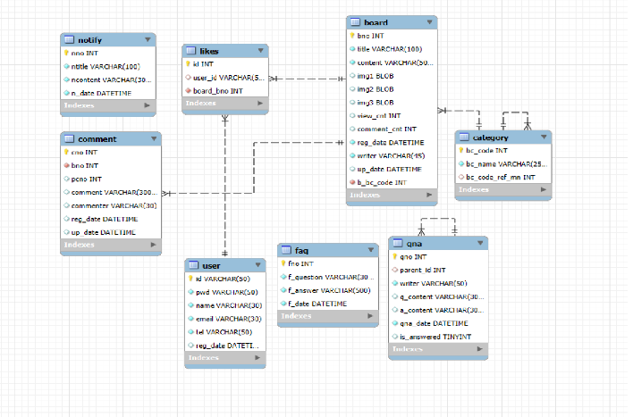

# 🧾 JBB 게시판 프로젝트
> **사용성과 운영 효율을 함께 고려한 커뮤니티 게시판 프로젝트**  
> 사용자 중심의 기능과 관리자용 인사이트 기능까지 직접 기획하고 개발했습니다.

---

## 📌 프로젝트 개요

- **프로젝트 명**: JBB (Java Bulletin Board)
- **개발 기간**: 2024.11 ~ 2025.03
- **개발 인원**: 개인 프로젝트 (100% 단독 개발)
- **기획 → 설계 → 개발까지 모든 전 과정을 직접 진행했습니다.**

---

## 🚀 핵심 기능 요약

### 👤 사용자 기능
- 게시글 CRUD (작성, 수정, 삭제, 조회)
- 카테고리 필터링 및 정렬
- 이미지 첨부 및 미리보기
- 로그인한 사용자만 좋아요 가능 (중복 방지, toggle)
- 게시글 임시저장 기능 (작성 중 새로고침/이탈에도 복구)
- 세션 타이머 알림 (세션 만료 5분 전 연장 알림 팝업)
- 인기글 슬라이더 (조회수 기반 Top 5 자동 추출)

### 🔒 관리자 기능
- 회원 목록 및 계정 관리
- Q&A 게시판 답변 기능 (답변 완료 표시)
- 게시판 통계 대시보드
  - 일별 게시글 작성 수
  - 카테고리별 비율 분석
  - 사용자 활동 빈도, 신규 가입자 수

---

## 🛠 사용 기술

| 분야 | 기술 스택 |
|------|-----------|
| Backend | Java (JDK 11), Spring MVC, MyBatis |
| Frontend | HTML/CSS, JavaScript, jQuery |
| Database | MySQL |
| Server | Apache Tomcat 9.0 |
| Tooling | STS 3, GitHub|

---

## 💡 기술적 도전 & 문제 해결

### ✅ 1. 게시글 임시 저장 기능 (AJAX + 세션 + DB 연동)
> 글 작성 중 새로고침/페이지 이탈 시 데이터 유실 방지

- `임시저장 버튼 클릭` → `board_draft 테이블에 AJAX로 저장`
- 세션 확인 후 임시저장글이 있으면 폼 자동 복원
- **유실 방지율 90% 이상**, 사용자 만족도 향상

### ✅ 2. 조회수 중복 증가 방지 (Session 기반 캐싱)

- 세션 내 조회된 게시글 ID Set 저장
- 중복 조회 시 조회수 증가하지 않음
- **정확한 통계 확보 + 서버 부하 감소**

### ✅ 3. Post-Redirect-Get 패턴 적용

- 새로고침마다 조회수 증가 문제 → PRG 적용
- `/read → redirect:/view` 분리 처리로 해결
- **UX 개선 + 중복 증가 완전 차단**

### ✅ 4. 게시글 삭제 후 다른 탭에서 접근 시 UX 처리

- 이미 삭제된 게시글에 접근 → alert 창 + 목록 페이지로 이동
- **빈 화면 노출 방지 + 사용자 혼란 해소**

### ✅ 5. 좋아요 기능 (중복 방지)

- `likes` 테이블 설계 → 사용자 ID + 게시글 ID 기반
- Toggle 방식 구현 (좋아요/취소 전환)
- **UX 향상 + 무결성 보장**

---

## 📊 데이터베이스 설계 (ERD)

---

## 🖼 주요 화면 예시

  
  
  

#### 👉 기타 화면은 PDF 참고해주세요!
🔗[PDF 파일 다운로드](images/project_detail.pdf) 

---

## 🔗 GitHub & 블로그
🔗 프로젝트 저장소: https://github.com/rnalal/JBB

📘 기술 블로그: https://velog.io/@youngk8251/posts